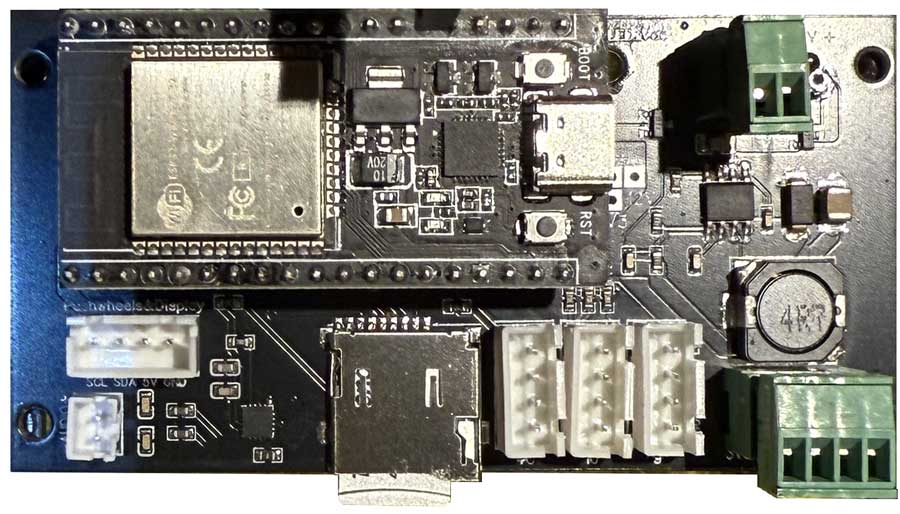

## Jukebox Control Board

The Control Board is a re-purposed Control Board originally used for the [VSR](https://vsr.out-a-ti.me).

It has connectors for
- power (unlike when used for a VSR, for the Jukebox, the connectors should be put on the front)
- signal LED and lights for illumination (labeled "9", "10", "4C")
- jog dials (XH4, front; labeled "Pushwheels")
- panel LEDs (XH-4AWD, rear)
- speaker for audio (PH 2pin)

To have [JCLPCB](https://jlcpcb.com) make your Control Board:
1) Create an account at jlcpcb.com
2) Click "Upload Gerber file" or "order now"
3) Upload the Gerber file (.zip, do not decompress!) for the PCB you want to make; leave all options at their defaults. You can choose a PCB color though...
4) Activate "PCB assembly", click "NEXT"
5) Enjoy a view of the PCB, click "NEXT"
6) Upload the BOM and "PickAndPlace" (CPL) files, click "Process BOM & CPL"
7) Read the remarks regarding the BOM below
8) Enjoy a nice 2D or 3D view of your future board, click "NEXT". (If the display stalls at "Processing files", click "NEXT" regardless).
9) Select a "product description" (eg. "Movie prop") and click "Save to cart". Then finalize your order.

#### Remarks on BOM (Bill of Materials):

1) You need to place _either_ "L1" _or_ "L2", not both. These are two alternative components, and they share the same physical location. In the "Bill of Materials" tab, deselect L1 or L2.
2) When clicking "Next", JLCPCB will complain about "unselected parts". Click "Do not place".

#### You additionally need:
- 1x NodeMCU ESP32 devboard, preferably with CP2102 USB-to-UART converter. 38pin, 25mm wide. For example: [This one](https://www.waveshare.com/nodemcu-32s.htm)
- If out of stock at JLCPCB: 2x 19pin femals headers, 8.5mm high, 2.54mm pitch (LCSC part number C7509529 or C2932678). If you can't get them for exactly 19 pins, get some longer ones and cut them.
- Screw terminals and XH connector on the back of the Control Board:
  - 2x DG308-2.54-02P-14-00A(H) (LCSC part number C699496) (or [any other](https://www.mouser.com/ProductDetail/Amphenol-Anytek/VN02A1500000G?qs=Mv7BduZupUgf8d3Xo6xdxw%3D%3D); 2.54mm pitch, 2 pins) for 5V and 12V connectors;
  - 1x XH-4AWD connector (LCSC part number C8877); this is for connecting the Panel LEDs.
- XH 4pin cable to connect the Jog Dials.
- XH 4pin cable to connect the signal LED and LEDs for illumination.
- the ability to solder through-the-hole parts, and the required tools.

_(If links to LCSC get you a 403 error, click into the URL field in your browser and press ENTER.)_
