# Jukebox Hardware & Build Information

Parts needed:
- Crosley CR-9 radio/cassette player
- [VSR control board](https://github.com/realA10001986/VSR/tree/main/Electronics/Control%20Board)
- Rotary Encoder controllers: 2x [DuPPA 2.1](https://www.duppa.net/product/i2cencoder-v2-1-2/) or [Adafruit 4991](https://www.adafruit.com/product/4991); 1x [DuPPA Mini](https://www.duppa.net/product/i2c-encoder-mini/) (due to space constrains)
- Rotary Encoders: 2x Bourns PEC11R-4320K-S0012, 1x Bourns PEC11R-4225K-S0024
- 2x [LED panel PCB](Electronics/LED_Panel)
- 2x Keyes 3W LED module (1x white, 1x blue; if you don't find those colors, just take cold-white and buy suitable LED beads, eg on amazon)
- Standard White LED (5mm)
- MicroSD extension
- 5V/2A power supply (eg. MeanWell RS-15-5)
- Cables with XH-4 connector on one end; one cable with female PH-2 connector for speaker.

[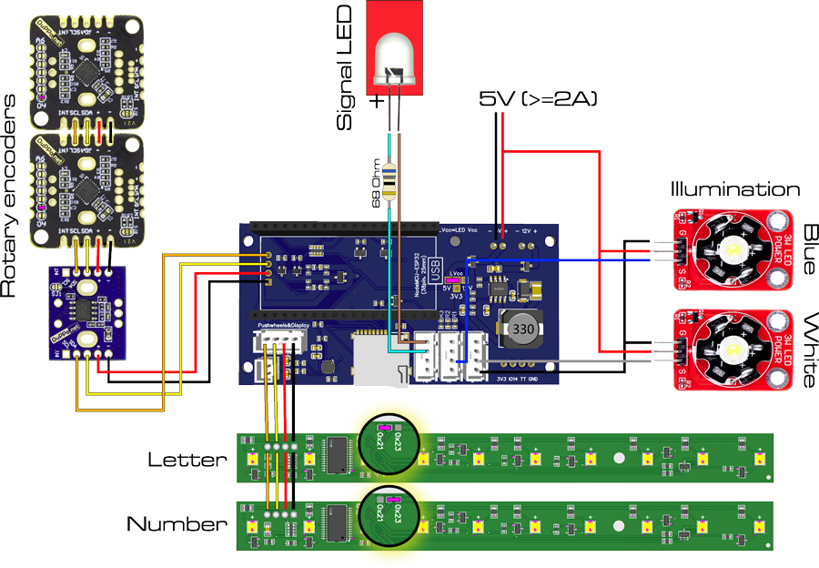](img/schematics-full.png)

### Disassemling the Crosley CR-9

Disassembling the radio is straight forward apart from the fact that many screws are covered in glue.

Parts to remove:
- the back plate (6 black screws on the back),
- the transformer (bottom right),
- the cassette player assembly (4 screws),
- the bezel holding the main PCB (4 screws; one of them goes through the rubber foot on the bottom). To take the bezel out, the radio frequency indicator must be freed by cutting the thread.
- all the lights (top and backlight for radio).
- the radio frequency scale.

### Panel LEDs

The faux letter/number button panel needs to be taken apart, the screws are on the rear. Afterwards cut off the stand-offs on the actual front part, it will be glued on in the end. 

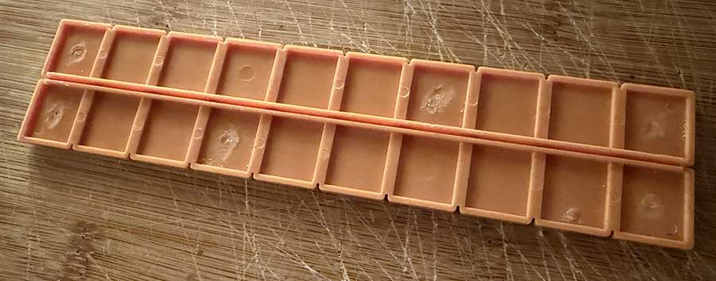

The PCBs fit exactly into the panel's enclosure, I just drilled two holes to hold them in place and additional holes for the wires. 

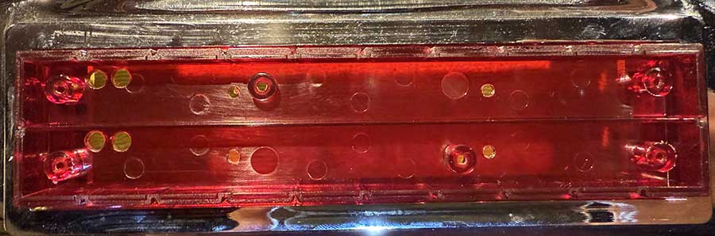

The PCBs have a solder jumper on the back. For the upper panel, "0x21" and center need to be joined, the the bottom one "0x23" and center. See schematics above.

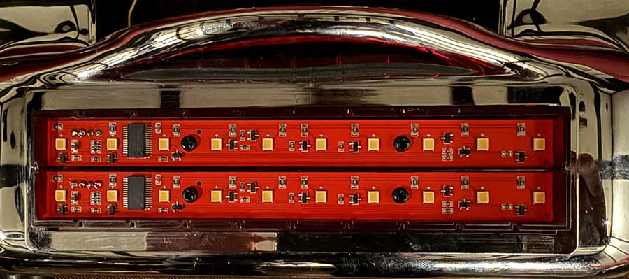

### VSR control board

The control board is a more or less unmodified [VSR](https://vsr.out-a-ti.me) control board.

Preparations:
- The LVcc solder jumper needs to be set to 5V.
- The power connector needs be soldered onto the top of the board, as opposed to the bottom like when used for a VSR.
- The XH-4AWD connector on the bottom is required unless you prefer daisy-chaining the LED panels and the rotary encoders (which I don't recommend). 

The control board is mounted in place of the old radio PCB. The screw holes match almost perfectly; I only had to cut away some material where the board itself and the ESP32 collide with the construction.

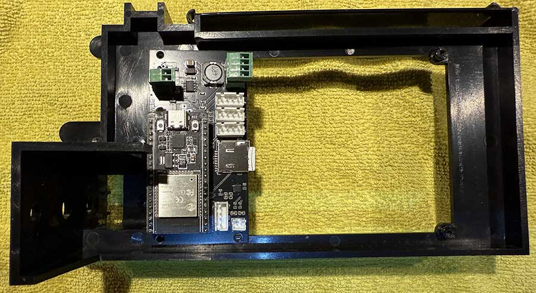

### Rotary Encoders

While the firmware supports both DuPPA and Adafruit, I recommend the DuPPA controllers, since those have a practical advantage: Two of them can be solder-joined. There needs to be around 1mm of space between them so that the knobs are centered in their holes:

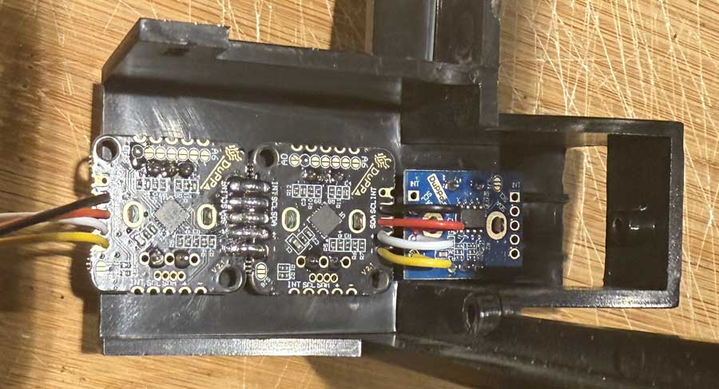

The bottom one is a DuPPA Mini, because the bezel is not wide enough for a regular DuPPA or the Adafruit. The elevated guides of the old screw need to be removed, a dremel works fine for the job.

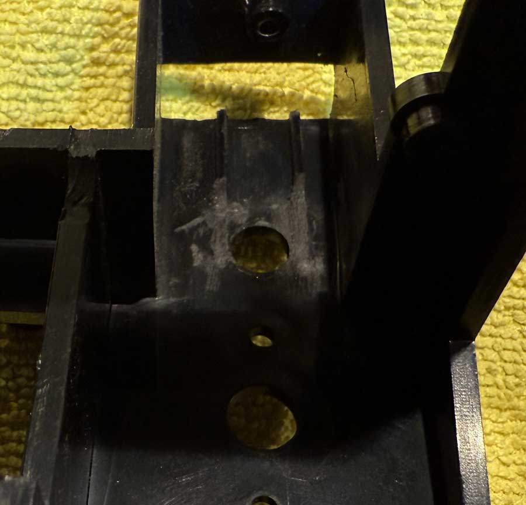

The controllers, from the top in final, upright position, are DuPPA/Adafruit (volume), DuPPA/Adafruit (jog dial 1), DuPPA Mini (jog dial 2). The DuPPAs' solder joints need to be set as shown in the schematics above. In case of Adafruit, the top one can be used in its default configuration, the middle one needs "A0" to be closed. The DuPPA Mini is automatically configured by the firmware.

The top one gets a PEC11R-4225K-S0024 for volume, the other two each a PEC11R-4320K-S0012 for letter/number selection. Do yourself a favor and don't use no-name Chinese rotary encoders, go for Bourns.

Optional: In order to make the buttons stick out more (which makes them easier to operate), I moved the bezel closer to the right hand side by drilling new screw holes right next to the old ones (purple arrows in the picture below). Also, I used a dremel to remove some material from the bezel (orange arrows) so that it can be moved further to the right without touching the button panel flap and the enclosure.

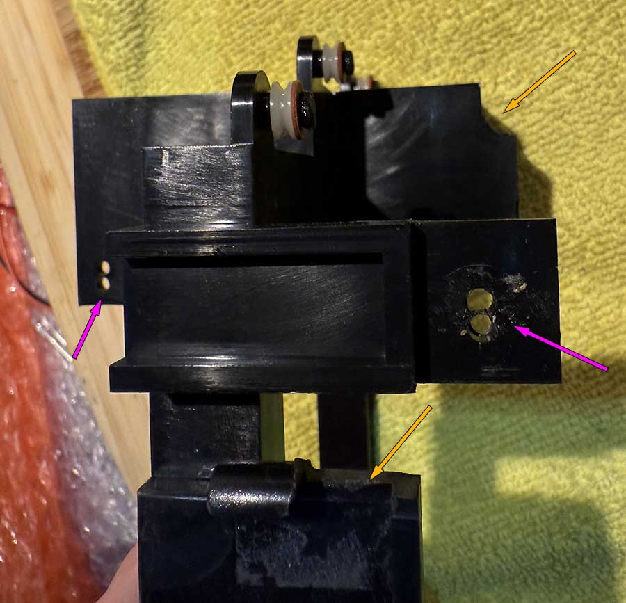

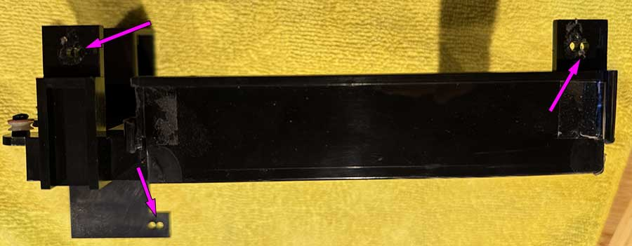

### Signal LED

A white standard 5mm LED is mounted in the red pseudo-button at the top and used by the firmware for signals. A regular white LED plus a 68 Ohm resistor do fine.

To detach the red button, remove the top chrome part as a whole:

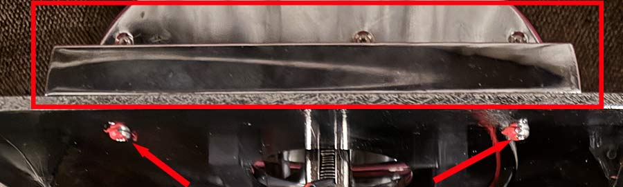

It is held in place by three or five screws through the ceiling of the menu area. You can then remove the lever that turns the menu page to make room for using a screw driver to press the latches and pull the button out. Inside are two springs, which are big enough to fit a LED in their center. Don't forget to insulate the LED's legs.

### Illumination

Two "Keyes" 3W high power LED modules are used for illumination. There are two LEDs: The front one should be warm-white, the rear one blue. 

The issues to overcome are chrome apparently being the enemy of most glues, and the fact that those LEDs tend to become very hot. The end result described below might appear a bit over-engineered, but after several failed attempts to attach those LEDs to the enclosure, I ran out of patience...

First, remove the LED beads from the modules and glue them onto a 65x65mm piece of aluminium like this, using thermal glue:

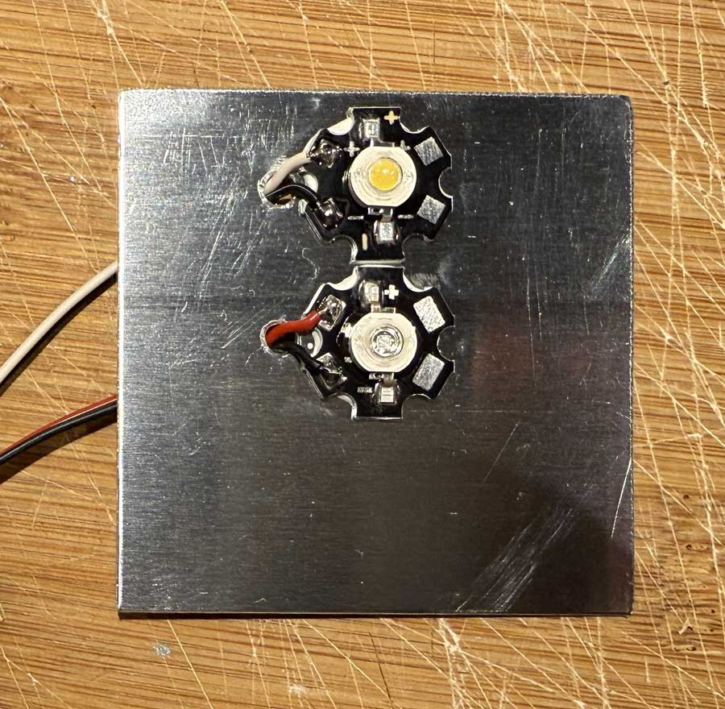

Then glue some acrylic onto the top of the window part (outer 10x10mm, inner 8x8mm):

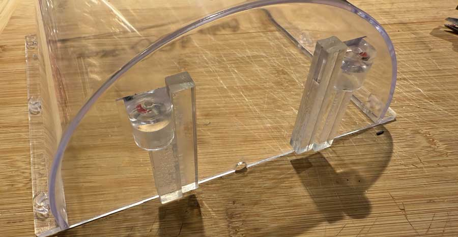

The idea is to rest the LED plate on the acrylic, held by tape:

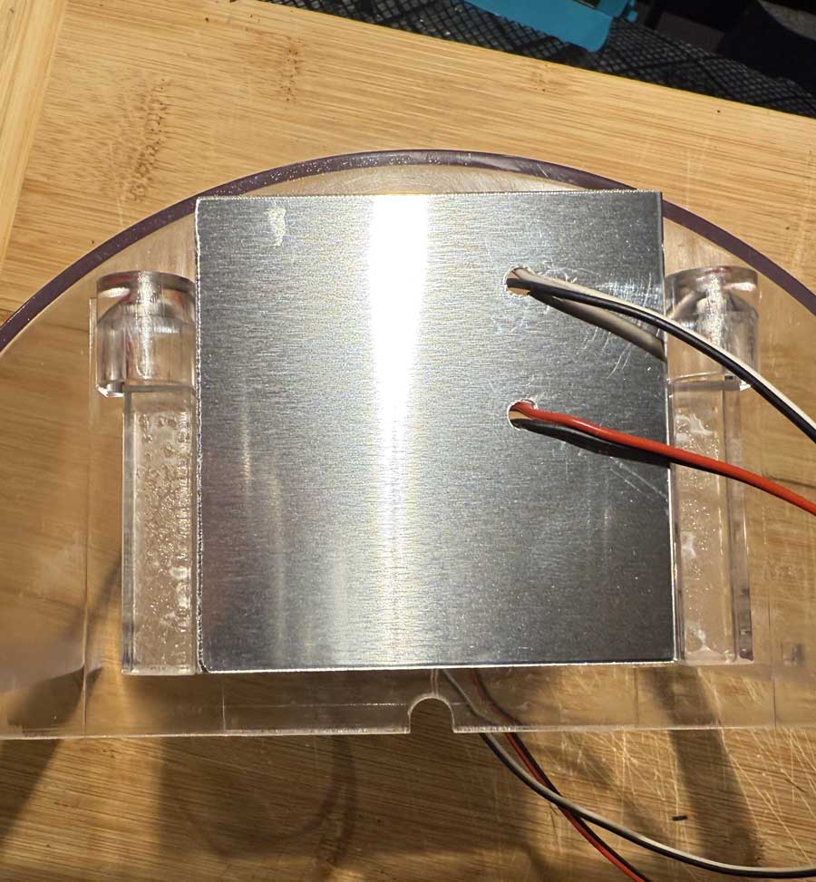

Put some double-sided self-adhesive tape on the inner acrylic guides, but leave the protective paper on the top on.

Assembly starts with the Jukebox bottom-up and is a bit tricky, reason being that the LED plate must be put in first because as soon as the window part is in position, the pseudo-button's enclosure blocks access.

First, put the LED plate in, let it rest loosely on the ceiling, with LEDs facing up. Then slide the window part with its acrylic "guides" and tape (still with protective paper) in position and attach it by at least two screws so it doesn't move. Then turn the Jukebox in upright position and use a pair of tweezers to pull off the protective paper from the tape on one side, while holding the LED plate up with pliers. As soon as the paper is off, carefully place the plate on the tape. Finally, do the same on the other side.

Then mount the Keyes modules somewhere and solder on the wires leading the the LED beads.

It looks like this after assembly:

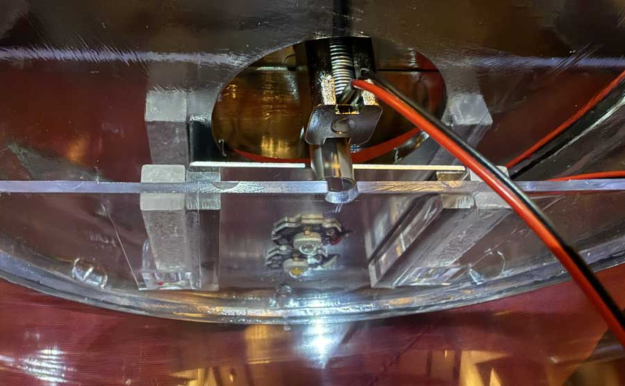

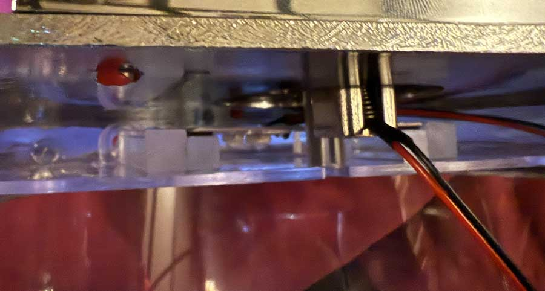

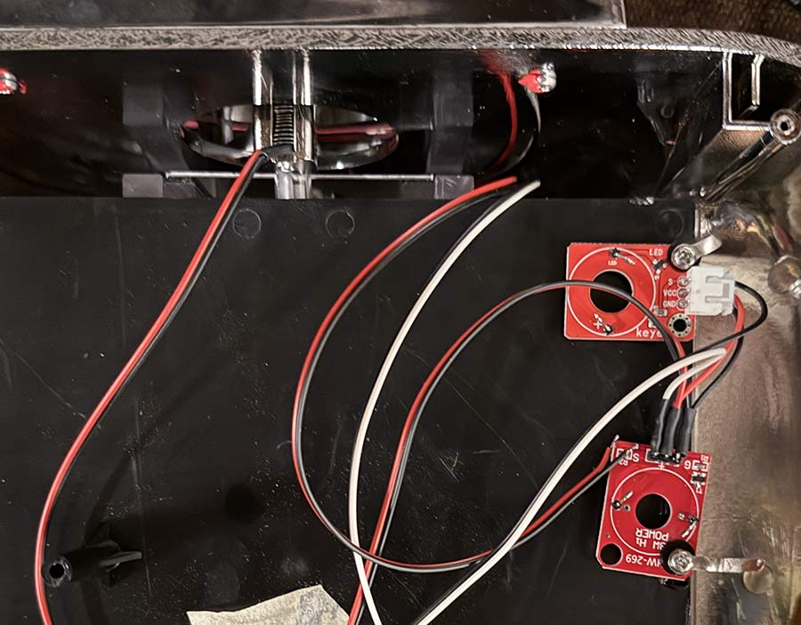

### Power supply

I went for a MeanWell RS-15-5 for its size and reliability (in my experience). It is mounted at the bottom, below the black bezel. It goes in last.

I drilled two 3mm holes into the bottom; first one 35mm from the rear edge of the Jukebox enclosure, the other 39.1mm in, and used suitable M3 machine screws to hold in place. 

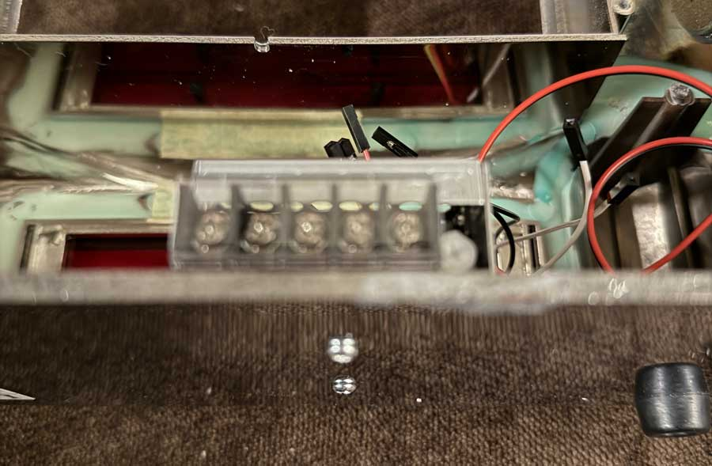

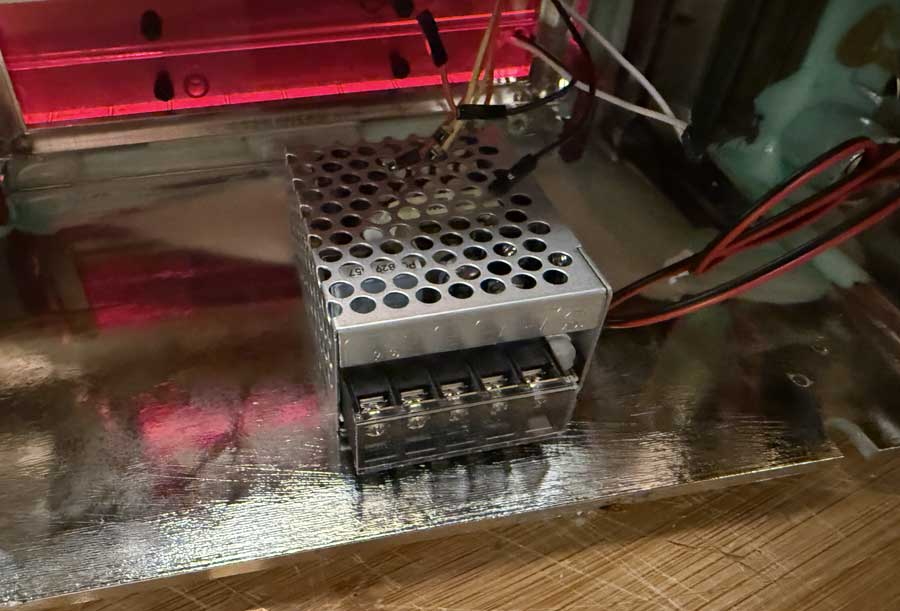

The power cord is secured by a proper cable tie attached to the bottom one of the screw holes formerly used to hold the transformer.

### Micro SD extension

Really any micro SD extension will do. Where you put the other end is up to you. 

I used [this one](https://www.ribu.at/mircosd-einbaubuchse-mit-microsd-verlaengerungskabel) and mounted it in the back plate.

### Final assembly result

Click on the images to see a high-resolution version.

[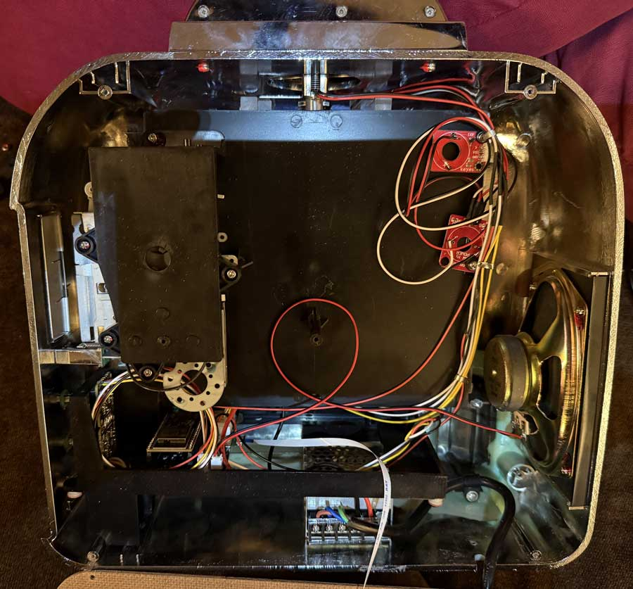](img/hw_final1l.jpg)

[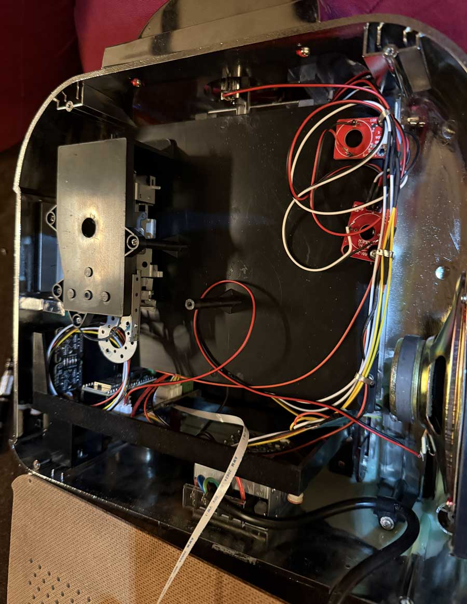](img/hw_final2l.jpg)

[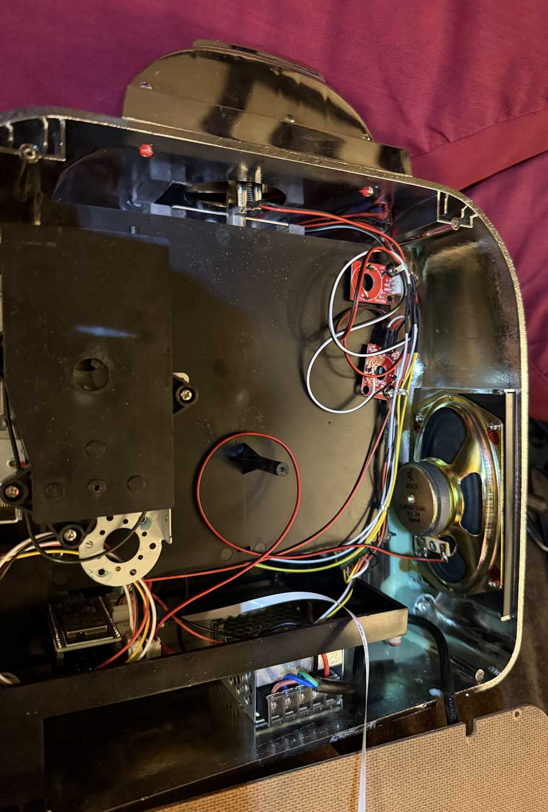](img/hw_final3l.jpg)

I left parts of the cassette assembly in to 1) avoid a big hole resulting from removing the Eject button, 2) give the device some weight.

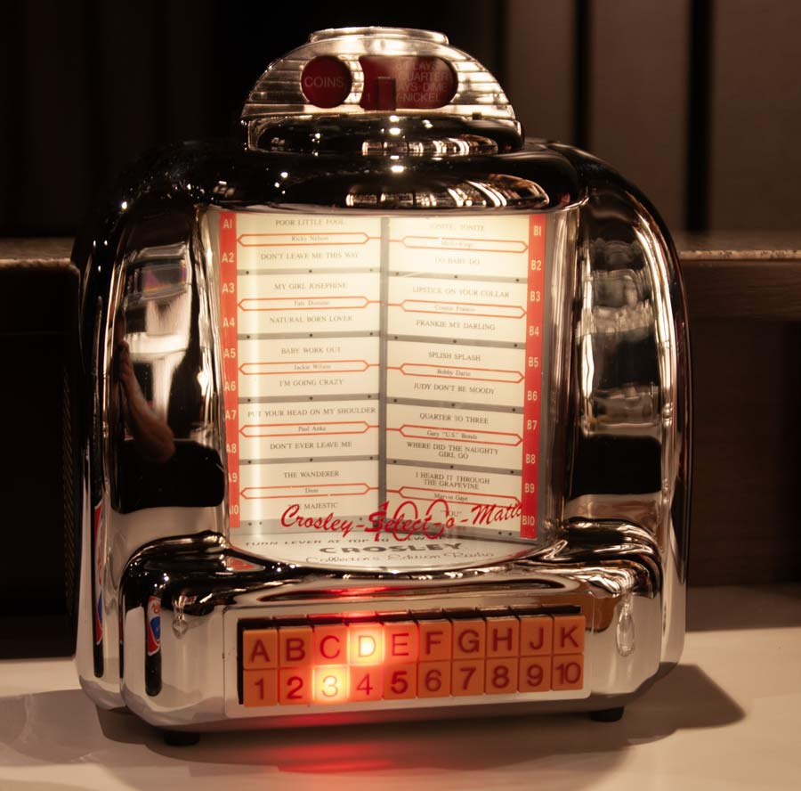

---
_Text & images: (C) Thomas Winischhofer ("A10001986"). See LICENSE._ [Source](https://jb.out-a%2dti.me)  
_Other props: [Time Circuits Display](https://tcd.out-a%2dti.me) ... [Flux Capacitor](https://fc.out-a%2dti.me) ... [SID](https://sid.out-a%2dti.me) ... [Dash Gauges](https://dg.out-a%2dti.me) ... [VSR](https://vsr.out-a%2dti.me) ... [Remote Control](https://remote.out-a%2dti.me) ... [TFC](https://tfc.out-a%2dti.me)_
