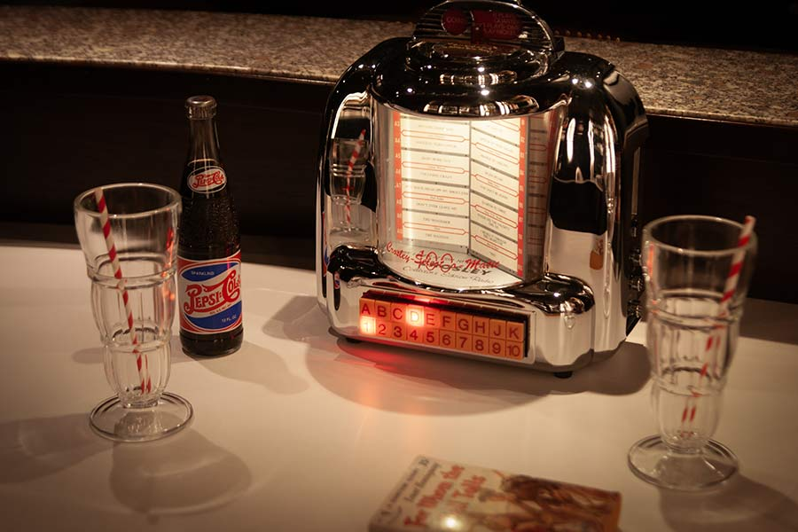
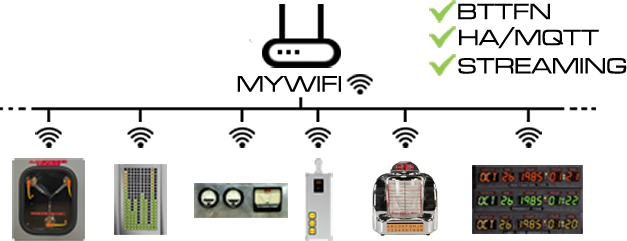
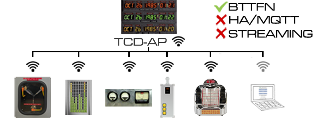
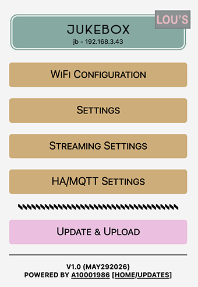
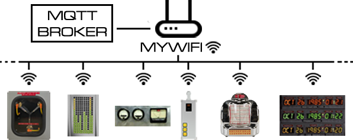

# Lou's Cafe Jukebox/Wallbox

This repository holds the firmware for a [modified](Hardware.md) Crosley CR-9 radio/cassette player. The CR-9 is inspired by the Seeburg Wall-O-Matic 100 3W1, which were used as props in Lou's Cafe in BTTF part 1. 

First things first: Why not go with a movie-accurate Seeburg?

- They are quite unsuitable for modification without major butchering. Ruining something that is a highly valued collector's item appeared to me as inappropriate given the small role the prop plays in the movie. Leave it to the Jukebox crowd.
- There is no room for a speaker, and no way for a speaker to release sound to the outside. Usually, when originals are "converted" into mp3 players, people use external speakers - which I wanted to avoid. There are no speakers anywhere in Lou's Cafe.
- The entire enclosure is made of metal, including the back plate. WiFi is seriously impeded.
- They are expensive and often optically and mechanically in dire straits, given their age.

So, I decided to go with the Crosley CR-9 instead. Modification instructions are [here](Hardware.md).

Firmware features include
- Three modes of operation:
  - Music Player to play the mp3 files from SD card; capacity 2000 tracks, organized in 20 folders for 100 tracks each
  - basic audio streaming from public internet streams (ShoutCast ICY over HTTP; audio/mpeg only, maximum bitrate 128kbps; HTTPS not supported)
  - Remote Mode: The Jukebox can remote control other music players through HA/MQTT
- Jog dials for track and stream selection, organized Jukebox-style (letter and number)
- advanced network-accessible [Config Portal](#the-config-portal) for setup (http://jb.local)
- [wireless communication](#bttf-network-bttfn) with [Time Circuits Display](https://circuitsetup.us/product/complete-time-circuits-display-kit/); used to remote control through TCD keypad as well as controlling the TCD's Music Player
- [Home Assistant](#home-assistant--mqtt) (MQTT) support. Used for remote-controlling the Jukebox, as well as a means of communication for the Jukebox to control third-party HA/MQTT-aware media players in Remote Mode.
- built-in OTA installer for firmware updates

For information on updating the firmware on your Jukebox, see [here](#firmware-installation--firmware-update).

## Initial Configuration

>The following instructions only need to be followed once, on fresh Jukeboxes. They do not need to be repeated after a firmware update.

The first step is to establish access to the Jukebox's configuration web site ("Config Portal"):

- Power up your Jukebox and wait until the startup sequence has completed.
- Connect your computer or handheld device to the WiFi network "JB-AP".
- Navigate your browser to http://jb.local or http://192.168.4.1 to enter the Config Portal.

### Connecting to a WiFi network

Your Jukebox knows two ways of WiFi operation: Either it creates its own WiFi network or it connects to a pre-existing WiFi network.

As long as your Jukebox is unconfigured, it creates its own WiFi network named "JB-AP". This mode of operation is called **"Access point mode"** or **"AP-mode"**. In this mode, computers/handhelds can connect to your Jukebox in order to access the Config Portal, but ways of communication end right here. There is no inter-prop-communication ([BTTFN](#bttf-network-bttfn)), no [HA/MQTT](#home-assistant--mqtt) and no streaming.
 

It is ok to leave it in AP-mode, predominantly if used stand-alone. To keep operating your Jukebox in AP-mode, simply _do not configure_ a WiFi network connection as described below.

More...

>Please do not leave computers/handhelds permanently connected to the Jukebox in AP-mode. These devices might think they are connected to the internet and therefore hammer the Jukebox with DNS and HTTP requests which might lead to disruptions.

>If you wish for your device to remain in AP-mode, please select a suitable WiFi channel on the Config Portal's "WiFi Configuration" page. See [here](#-wifi-channel).

> In AP-mode, the Jukebox can switch off WiFi to save power. See [here](#wifi-power-saving-features).

#### Home setup with a pre-existing local WiFi network

In this case, you can connect your Jukebox to your home WiFi network. This allows for inter-prop-communication ([BTTFN](#bttf-network-bttfn)) and [HA/MQTT](#home-assistant--mqtt). If your home WiFi has internet access, streaming is possible.

Click on "WiFi Configuration" and either select a network from the top of the page or enter a WiFi network name (SSID), and enter your WiFi password. After saving the WiFi network settings, your Jukebox reboots and tries to connect to your selected WiFi network. 

More...

>If there are several APs with identical SSID in your area, you can select a specific AP to use by its BSSID (AP's MAC address). You can either manually find out your AP's BSSID and enter it or have it filled out automatically: Click "Scan for networks", then "Show all". If you click on an AP, its BSSID will be copied into BSSID field in the form below. To see which AP is which, hover over the name to see its BSSID as a tooltip.

>Your Jukebox requests an IP address via DHCP, unless you entered valid data in the fields for static IP addresses (IP, gateway, netmask, DNS). If the device is inaccessible as a result of incorrect static IPs, hold the bottom knob for 5 seconds while fake-power is off; static IP data will be deleted and the device will return to DHCP after rebooting.

If the Jukebox fails to connect, it falls back to AP-mode. You can trigger another connection attempt by holding the middle knob for 2 seconds while fake-power is off.

#### Places without a WiFi network

In this case and with no [Time Circuits Display](https://circuitsetup.us/product/complete-time-circuits-display-kit/) at hand, keep your Jukebox operating in AP-mode.

If you have a TCD, you can connect your Jukebox to the TCD's own WiFi network: 

After completing WiFi setup, your Jukebox is ready for use; you can also continue configuring it to your personal preferences through the Config Portal.

## The Config Portal

The "Config Portal" is the Jukebox's configuration web site. 

|  |
|:--:| 
| *The Config Portal's main page* |

It can be accessed as follows:

#### If the Jukebox is in AP mode

- Connect your computer or handheld device to the WiFi network "JB-AP".
- Navigate your browser to http://jb.local or http://192.168.4.1 to enter the Config Portal.
- (For proper operation, please disconnect your computer or handheld from JB-AP when you are done with configuring your Jukebox. These devices can cause high network traffic, resulting in severe performance penalties.)

#### If the Jukebox is connected to a WiFi network

- Connect your handheld/computer to the same (WiFi) network to which the Jukebox is connected, and
- navigate your browser to http://jb.local  

More...

  >Accessing the Config Portal through this address requires the operating system of your handheld/computer to support Bonjour/mDNS: Windows 10 version TH2     (1511) [other sources say 1703] and later, Android 13 and later; MacOS and iOS since the dawn of time.

  >If connecting to http://jb.local fails due to a name resolution error, you need to find out the JB's IP address: XXXX and listen, the IP address will be spoken out loud. Then, on your handheld or computer, navigate to http://a.b.c.d (a.b.c.d being the IP address as read out loud by the Jukebox) in order to enter the Config Portal.

A full reference of the Config Portal is [here](#appendix-a-the-config-portal).

## Basic Operation

The Jukebox is basically a music player or a remote control for external Music Players. It is controlled by three knobs. These knobs are called "Power button", "Jog dial 1" and "Jog dial 2". All three can be turned as well as pressed.

Buttons can be _pressed_ or _held_. _Pressing_ means pressing and releasing the button within less than 2 seconds. _Holding_ a button means holding it pressed-down for 2 seconds or longer.

The top-most knob ("Power button") is used for fake-power, mode switching and volume: 
- Pressing the power button while the unit is fake-off switches fake-power on.
- Pressing the power button while the unit is fake-on switches between Music Player, streaming and Remote mode. The first time pressed within 5 seconds announces the current mode, and following press advances the mode of operation.
- Holding it for 2 seconds while fake power is on fake-powers it off.
- Turning the knob adjusts the volume level.

The jog dials' functions differ depending on fake-power.

When fake-power is on:

Middle knob ("Jog dial 1"):
- Turning the knob selects the Jukebox letter
- pressing the knob stops, or starts play-back at the selected track/stream.
- holding the knob down for 2 seconds toggles "shuffle"

Bottom knob ("Jog dial 2"):
- Turning the knob selects the Jukebox number
- pressing the knob advances playback to the next track/stream unless letter or number have been changed and don't display the currently played track/stream, in which case pressing the button starts playback of the selected track (like the middle knob)
- holding the knob down for 2 seconds jumps back to the previous track/stream

When fake-power is off:

Middle knob ("Jog dial 1"):
- Pressing the knob briefly tells you the current IP address
- Holding the knob down for 2 seconds reconnects WiFi, or re-activates the WiFi AP when in power-save mode.
  
Bottom knob ("Jog dial 2"):
- Pressing the knob starts music folder selection:
  - The current folder is displayed in the panel (A-K, 1-10)
  - Turning the knob allows changing the music folder. Only folders that actually exist and contain music files can be selected.
  - Pressing the knob again selects the currently lit folder and finalizes folder selection. 
- Holding the knob down for 5 seconds deletes the static IP and WiFi AP password and, in case either was set, reboots; the top red light starts blinking after 2 seconds to warn

## Mode 1: Music Player

The Music Player plays mp3 files located on the SD card. *The maximum bitrate is 128kpbs.* An excellent utility to re-encode your MP3 files in batches is [Adapter](https://macroplant.com/adapter/audio-converter), available for Mac and Windows.

To be recognized, your mp3 files need to be organized in music folders named *musicA* through *musicK* and *music1* through *music10*. The default folder number is musicA. The folder can be changed using the jog dial 2 as described above.

When copying tracks to the SD card, it is recommended to use the following naming scheme:

musicX/A_01_xxxx.mp3  
musicX/A_02_xxxx.mp3  
...  
musicX/A_10_xxxx.mp3  
musicX/B_01_xxxx.mp3  
...  
musicX/B-10_xxxx.mp3  
...  
musicX/K-10_xxxx.mp3  

>When the firmware finds a fresh music folder, it sorts the files alphabetically and renames them to an internally used format which has audio files named 000.mp3 through 099.mp3.

You can also add files to a music folder later; when you do so, delete the file "TCD_DONE.TXT" from the music folder on the SD card so that the firmware knows that something has changed. The new files will be added in alphabetical order.

By default, the tracks are played in order, starting at A-1, followed by A-2 and so on. By holding jog dial 1 you can toggle shuffle mode, in which mode the tracks are played in random order. Shuffle mode is saved and persistent.

## Mode 2: Streaming

Due to memory and CPU speed limitations, the streaming feature is, unfortunately, somewhat limited:
- Only MPEG-1, MPEG-2, MPEG 2.5 (Layer I, Layer II, Layer III a.k.a. MP3) at <= 128kbps are supported, 
- only http (not https) is supported; however, many streams broadcast on both, so try http even if the links says https.
- a _good_ WiFi and internet connection is required due to a small buffer.

The stream URLs are configured on the Config Panel. 

Streams are selected like tracks in Music Player mode.

## Mode 3: Remote mode

In Remote Mode, the Jukebox can control a remote HomeAssistant/MQTT-enabled music player.

The MQTT topics and messages for control are configured in the [Config Portal](#settings-for-remote-mode).  

If the remote player supports a somewhat complete [backchannel](#-remote-player-backchannel), track selection works just like in Music Player mode: Jog dials 1 and 2 select letter and number, pressing the button selects the chosen track and starts play-back. If there is no compatible backchannel, only "play", "stop", "next" and "prev" are supported through the jog dials.

## SD Card

>Preface note on SD cards: For unknown reasons, some SD cards simply do not work with this device. For instance, I had no luck with Sandisk Ultra 32GB and  "Intenso" cards. If your SD card is not recognized, check if it is formatted in FAT32 format (not exFAT!). Also, the size must not exceed 32GB (as larger cards cannot be formatted with FAT32). Transcend, Sandisk Industrial, Verbatim Premium and Samsung Pro Endurance SDHC cards work fine in my experience.

Note that the SD card must be inserted before powering up the device. It is not recognized if inserted while the Jukebox is running. Furthermore, do not remove the SD card while the device is powered.

Since the SD card on the control board is inaccessible after assembling the Jukebox, installing a microSD extension (like [this one](https://www.amazon.com/Memory-Micro-SD-Female-Extension-Extender/dp/B09MS85FQ3/)) is recommended.

### Sound substitution

The Jukebox's built-in sound effects can be substituted by your own sound files on a FAT32-formatted SD card. These files will be played back directly from the SD card during operation, so the SD card has to remain in the slot.

Your replacements need to be put in the root (top-most) directory of the SD card, be in mp3 format (128kbps max) and named as follows:
- "alarm.mp3". Played when the alarm sounds (triggered by a Time Circuits Display via BTTFN or MQTT);
- "0.mp3" through "9.mp3", "dot.mp3": Numbers for IP address read-out;
- "volchg.mp3": Played when using the volume knob to change volume level when no other sound is played

The following sounds are time-sync'd to display action. If you decide to substitute these with your own, be prepared to lose synchronicity:
- "startup.mp3". Played when the Jukebox is connected to power and finished booting

#### Installing Replacement Audio Files

Replacements can either be uploaded through the Config Portal or copied to the SD card using a computer.

Uploading through the Config Portal works exactly like [installing the sound-pack](#sound-pack-installation); on the main menu, click "Update & Upload". Afterwards choose one or more mp3 files to upload using the bottom file selector, and click "UPLOAD". The firmware will store the uploaded mp3 files on the SD card.

To delete a file from the SD card, upload a file whose name is prefixed with "delete-". For example: To delete "startup.mp3" from the SD card, upload a file named "delete-startup.mp3"; the file's contents does not matter, so it's easiest to use a newly created empty file. The firmware detects the "delete-" part and, instead of storing the uploaded file, it throws it away and deletes "startup.mp3" from the SD card.

For technical reasons, the Jukebox must reboot after mp3 files are uploaded in this way.

Please remember that the maximum bitrate for mp3 files is 128kbps. Also note that the uploaded file is stored to the root folder of the SD card, so this way of uploading cannot be used to upload music for the Music Player. 

## Connecting a Time Circuits Display

### BTTF-Network ("BTTFN")

The TCD can communicate with the Jukebox wirelessly, via the built-in "**B**asic-**T**elematics-**T**ransmission-**F**ramework" over WiFi. It can send out information about a time travel and an alarm, and the Jukebox queries the TCD for some status data. Furthermore, the TCD's keypad can be used to remote-control the Jukebox.

BTTFN requires the props all to be connected to the same network, such as, for example, your home WiFi network, or the TCD acting as access point. BTTFN does not work over the Internet.

&nbsp;

More...

  
>The term "WiFi network" is used for both "WiFi network" and "ip subnet" here for simplicity reasons. However, for BTTFN communication, the devices must be on the same IP subnet, regardless of how they take part in it: They can be connected to different WiFi networks, if those WiFi networks are part of the same ip subnet.

To connect your Jukebox to the TCD, just enter the TCD's hostname - usually "timecircuits" - in the **_Hostname or IP address of TCD_** field in the Jukebox's Config Portal. On the TCD, no special configuration is required. 
  
Afterwards, the Jukebox and the TCD can communicate wirelessly and 
- the Jukebox can be remote controlled through the TCD's keypad (command codes 5xxx),
- the Jukebox queries the TCD for night mode, in order to react accordingly if so configured,
- the devices play time travel sequences in sync,
- the Jukebox plays an alarm-sequence when the TCD's alarm occurs,

You can use BTTF-Network and MQTT at the [same time](#receive-commands-from-time-circuits-display).

#### Remote Control Reference

Numbers are the code to be entered on the TCD keypad if a TCD is connected via [BTTF-Network](#bttf-network-bttfn).

<table id='commandref'>
    <tr>
     <td align="center" colspan="2">Command sequences</td>
    </tr>
    <tr><td>Function</td><td>Code on TCD</td></tr>
      <tr>
     <td align="left">Select Music Player mode</td>
     <td>5020</td>
     </tr>
     <tr>
     <td align="left">Select Streaming Mode</td>
     <td>5021</td>
     </tr>
    <tr>
     <td align="left">Select Remote Mode</td>
     <td>5022</td>
     </tr>
     <tr>
     <td align="left">Select audio volume level (0-20)</td>
     <td>5300-5320</td>
     </tr>
    <tr>
     <td align="left">Select music folder for <a href="#the-music-player">Music Player</a> (0-9)</td>
     <td>5050-5059</td>
    </tr>
    <tr>
     <td align="left">Shuffle off (for Music Player and Remote mode)</td>
     <td>5222</td>
    </tr>
    <tr>
     <td align="left">Shuffle on  (for Music Player and Remote mode)</td>
     <td>5555</td>
    </tr> 
    <tr>
     <td align="left">Go to track/stream A 1</td>
     <td>5888</td>
    </tr>
    <tr>
     <td align="left">Go to track/stream x y (x=01-10 equivalent to letter; y=01-10)</td>
     <td>588xxyy</td>
    </tr>
    <tr>
     <td align="left">Say current IP address</td>
     <td>5090</td>
    </tr>
    <tr>
     <td align="left">Reboot the device (**)</td>
     <td>5064738</td>
    </tr>
    <tr>
     <td align="left">Toggle firmware update signals at power-up</td>
     <td>5053281</td>
    </tr>
    <tr>
     <td align="left">Delete static IP address and AP WiFI password (**)</td>
     <td>5123456</td>
    </tr>
</table>

[Here](CheatSheet.pdf) is a cheat sheet for printing or screen-use.

## Home Assistant / MQTT

The Jukebox supports MQTT protocol versions 3.1.1 and 5.0 for the following features:
- The Jukebox can remote control music players,
- The Jukebox can be remote controlled,
- the Jukebox can receive some data from the TCD (time-travel, alarm, night mode)

### Remote Mode: Remote control third party MQTT-enabled music player

This is explained in detail [here](#settings-for-remote-mode).

### Control the Jukebox via MQTT

The Jukebox can be controlled through messages sent to topic bttf/_hostname_/cmd, by default **bttf/jb/cmd**. Supported commands are
- MODE_MP: Switch to Music Player mode
- MODE_STREAM: Switch to streaming mode
- MODE_REMOTE; Switch to Remote Mode
- PLAY: Start the [Music Player](#the-music-player) or streaming, or send a "play" command to the remote controlled music player
- STOP: Stop the [Music Player](#the-music-player) or streaming, or send a "stop" command to the remote controlled music player
- NEXT: Jump to next track/stream, or send a "next" command to the remote controlled music player
- PREV: Jump to previous track/stream, or send a "previous" command to the remote controlled music player
- SHUFFLE_ON: Enables shuffle mode for [Music Player](#the-music-player) or the remote controlled music player
- SHUFFLE_OFF: Disables shuffle mode for [Music Player](#the-music-player) or the remote controlled music player
- FOLDER_X: Set folder for [Music Player](#the-music-player) (X=A-K [I is skipped] or 0-9)
- GOTO_X_Y: Goto track/stream X-Y (X=A-K, Y=1-10), or send "goto" command to remote controlled music player
- VOLUME_SET_X: Set audio volume to X% (0-100).
- VOLUME_UP, VOLUME:DOWN: Increase/decrease audio volume a notch.
- POWER_CONTROL_ON: Take over Fake-Power control; POWER_xx commands now control Fake-Power.
- POWER_CONTROL_OFF: Release Fake-Power control
- POWER_ON, POWER_OFF: Switch Fake-Power on or off, respectively.
- NIGHTMODE_ON, NIGHTMODE_OFF: Switches night mode on/off. These commands are only executed if no TCD is connected through BTTFN, or the option _Follow TCD night-mode_ is unchecked in the Config Portal.

### Receive commands from Time Circuits Display

If both TCD and Jukebox are connected to the same broker, and the option **_Publish time travel and alarm events_** is checked on the TCD's side, the Jukebox will receive information on time travel and alarm and play their sequences in sync with the TCD. Unlike BTTFN, however, no other communication takes place.

MQTT and BTTFN can co-exist. However, the TCD only sends out time travel and alarm notifications through either MQTT or BTTFN, never both. If you have other MQTT-aware devices listening to the TCD's public topic (bttf/tcd/pub) in order to react to time travel or alarm messages, use MQTT (ie check **_Publish time travel and alarm events_**). If only BTTFN-aware devices are to be used, uncheck this option to use BTTFN as it has less latency.

### Setup

MQTT requires a "broker" (such as [mosquitto](https://mosquitto.org/), [EMQ X](https://www.emqx.io/), [Cassandana](https://github.com/mtsoleimani/cassandana), [RabbitMQ](https://www.rabbitmq.com/), [Ejjaberd](https://www.ejabberd.im/), [HiveMQ](https://www.hivemq.com/) to name a few).

The broker's address needs to be configured in the Config Portal. It can be specified either by domain or IP (IP preferred, spares us a DNS call). The default port is 1883. If a different port is to be used, append a ":" followed by the port number to the domain/IP, such as "192.168.1.5:1884". 

If your broker supports protocol version 3.1.1, stick with 3.1.1. Version 5.0 has no advantages, but more overhead.

If your broker does not allow anonymous logins, a username and password can be specified.

Limitations: TLS/SSL not supported; ".local" domains (MDNS) not supported; server/broker must respond to PING (ICMP) echo requests. For proper operation with low latency, it is recommended that the broker is on your local network. MQTT is disabled when your Jukebox is operated in AP-mode or when connected to the TCD run in AP-Mode (TCD-AP).

## WiFi Power Saving Features

The Config Portal offers an option for WiFi power saving for AP-mode (ie when the device acts as an access point). This option configures a timer after whose expiration WiFi is switched off; the device is no longer transmitting or receiving data over WiFi.

The timer can be set to 0 (which disables it; WiFi is never switched off; this is the default) or 10-99 minutes. 

After WiFi has been switched off due to timer expiration, it can be re-enabled by holding the middle knob for 2 seconds while fake-power is off, in which case the timers are restarted (ie WiFi is again switched off after timer expiration).

> This procedure is also used to trigger a re-connection attempt in case your configured WiFi network was not available when the Jukebox was trying to connect, see [here](#home-setup-with-a-pre-existing-local-wifi-network).

## Flash Wear

Flash memory has a somewhat limited lifetime. It can be written to only between 10.000 and 100.000 times before becoming unreliable. The firmware writes to the internal flash memory when saving settings and other data. Every time you change settings, data is written to flash memory.

In order to reduce the number of write operations and thereby prolong the life of your Jukebox, it is recommended to use a good-quality SD card and to check **_[Save secondary settings on SD](#-save-secondary-settings-on-sd)_** in the Config Portal; secondary settings are then stored on the SD card (which also suffers from wear but is easy to replace). See [here](#-save-secondary-settings-on-sd) for more information.

## Firmware Installation / Firmware Update

If a previous version of the Jukebox firmware is installed on your device, you can update easily using the pre-compiled binary. Enter the [Config Portal](#the-config-portal), click on "Update & Upload", select the pre-compiled binary file ("**jukebox-A10001986-Vx.xxx.bin**") provided in the [Release package](https://github.com/realA10001986/Jukebox/releases), and click on *Update*.

Installing on a fresh ESP32...

If you are using a fresh ESP32, please go <a href="https://install.out-a-ti.me">here</a> and follow the instructions or - if you are a nerd and want to deal with source code, compilers'n'stuff - see <a href="https://github.com/realA10001986/Jukebox/blob/main/jukebox-A10001986/jukebox-A10001986.ino">jukebox-A10001986.ino</a> for detailed build and upload information.

*After a firmware update, the red LED might blink for short while after reboot. Do NOT unplug the device during this time.*

### Sound-pack installation

The firmware comes with a sound-pack which needs to be installed separately. The sound-pack is not updated as often as the firmware itself. There will be a message in the Config Portal and a respective [signal](#appendix-b-led-signals) at startup when/if the sound-pack needs to be updated.

_Note that installing the sound-pack requires an [SD card](#sd-card)._

The first step is to extract "sound-pack-jbXX.zip" (which is included in every [Release package](https://github.com/realA10001986/Jukebox/releases)). It contains one file, named "JBA.bin".

Next, head to the [Config Portal](#the-config-portal), click on "Update & Upload", select the "JBA.bin" file in the _bottom_ file selector and click on *Upload*.

Alternative way

Alternatively, you can install the sound-pack the following way:
- Using a computer, copy "JBA.bin" to the root directory of a FAT32 formatted SD card;
- power down the Jukebox,
- insert this SD card into the slot and 
- power up the Jukebox; the sound-pack will be installed automatically.

---

## Appendix A: The Config Portal

### Main page

##### &#9193; WiFi Configuration

This leads to the [WiFi configuration page](#wifi-configuration)

##### &#9193; Settings

This leads to the [Settings page](#settings).

##### &#9193; Streaming Settings

This leads to the [Streaming Settings page](#streaming-settings).

##### &#9193; HA/MQTT Settings

This leads to the [HomeAssistant/MQTT Settings page](#hamqtt-settings).

##### &#9193; Update & Upload

This leads to the firmware update and audio upload page.

To upload a new firmware, such as published in the [Release packages](https://github.com/realA10001986/Jukebox/releases), select the "**jukebox-A10001986-Vx.xxx.bin**" file as contained in the Release package in the _top_ file selector and click *Update*.

You can also install the Jukebox's sound-pack on this page; download the sound-pack (which is included in every [Release package](https://github.com/realA10001986/Jukebox/releases)), extract it and select the resulting JBA.bin file in the _bottom_ file selector. Finally, click *Upload*. Note that an SD card is required for this operation.

See also [here](#firmware-installation--firmware-update).

Finally, this page is also for uploading [replacement sound files](#installing-replacement-audio-files) to the SD card. Select an mp3 file in the _bottom_ file selector and click *Upload*. (Maximum 16 files at a time.)

---

### WiFi Configuration

Through this page you can either connect your Jukebox to your local WiFi network or configure AP mode. 

#### <ins>Connecting to an existing WiFi network</ins>

To connect your Jukebox to your WiFi network, all you need to do is either to click on one of the networks listed at the top or to enter a __Network name (SSID)__, and optionally a __password__ (WPAx). If there is no list displayed, click on "Scan for Networks".

>By default, the Jukebox requests an IP address via DHCP. However, you can also configure a static IP for the Jukebox by entering the IP, netmask, gateway and DNS server. All four fields must be filled for a valid static IP configuration. If you want to stick to DHCP, leave those four fields empty.

If there are several APs with identical SSID in your area, you can select a specific AP to use by its BSSID (AP's MAC address). You can either manually find out your AP's BSSID and enter it or have it filled out automatically: Click "Scan for networks", then "Show all". If you click on an AP, its BSSID will be copied into BSSID field in the form below. To see which AP is which, hover over the name to see its BSSID as a tooltip.

##### &#9193; Forget Saved WiFi Network

Checking this box (and clicking SAVE) deletes the currently saved WiFi network (SSID and password as well as static IP data) and reboots the device; it will restart in "access point" (AP) mode. See [here](#connecting-to-a-wifi-network).

##### &#9193; Hostname

The device's hostname in the WiFi network. Defaults to 'jb'. This also is the domain name at which the Config Portal is accessible from a browser in the same local network. The URL of the Config Portal then is http://<i>hostname</i>.local (the default is http://jb.local)

The hostname is also used in MQTT topic names: The command topic is **bttf/_hostname_/cmd**, the backchannel **bttf/_hostname_/mpstatus**.

If you have more than one Jukebox in your local network, please give them unique hostnames.

_This setting applies to both AP-mode and when your Jukebox is connected to a WiFi network._ 

##### &#9193; WiFi connection attempts

Number of times the firmware tries to reconnect to a WiFi network, before falling back to AP-mode. See [here](#connecting-to-a-wifi-network)

#### <ins>Settings for AP-mode</ins>

##### &#9193; Network name (SSID) appendix

By default, when your Jukebox creates a WiFi network of its own ("AP-mode"), this network is named "JB-AP". In case you have multiple Jukeboxs in your vicinity, you can have a string appended to create a unique network name. If you, for instance, enter "-ABC" here, the WiFi network name will be "JB-AP-ABC". Characters A-Z, a-z, 0-9 and - are allowed.

##### &#9193; Password

By default, and if this field is empty, the Jukebox's own WiFi network ("JB-AP") will be unprotected. If you want to protect your Jukebox access point, enter your password here. It needs to be 8 characters in length and only characters A-Z, a-z, 0-9 and - are allowed.

If you forget this password and are thereby locked out of your Jukebox, hold the bottom knob for 5 seconds while fake-power is off; this deletes the WiFi password and reboots. The access point will start unprotected.

##### &#9193; WiFi channel

Here you can select one out of 11 channels or have the Jukebox choose a random channel for you. The default channel is 1. Preferred are channels 1, 6 and 11.

WiFI channel selection is key for a trouble-free operation. Disturbed WiFi communication can lead to disrupted sequences, packet loss, hanging or freezing props, and other problems. A good article on WiFi channel selection is [here](https://community.ui.com/questions/Choosing-the-right-Wifi-Channel-on-2-4Ghz-Why-Conventional-Wisdom-is-Wrong/ea2ffae0-8028-45fb-8fbf-60569c6d026d).

If a WiFi Scan was done (which can be triggered by clicking "Scan for Networks"), 

- a list of networks is displayed at the top of the page; click "Show All" to list all networks including their channel;
- a "proposed channel" is displayed near the "WiFi channel" drop-down, based on a rather simple heuristic. The banner is green when a channel is excellent, grey when it is impeded by overlapping channels, and when that banner is red operation in AP mode is not recommended due to channels all being used.

The channel proposition is based on all WiFi networks found; it does not take non-WiFi equipment (baby monitors, cordless phones, Bluetooth devices, microwave ovens, etc) into account.

##### &#9193; Power save timer

See [here](#wifi-power-saving-features).

---

### Settings

#### <ins>Basic settings</ins>

##### &#9193; Play Jukebox sounds

If this option is checked, the Jukebox will, in Music Player mode, play typical Jukebox sound effects when playback is started and stopped, and between tracks.

##### &#9193; Play TCD-alarm sounds

If a TCD is connected via BTTFN or MQTT, the Jukebox visually signals when the TCD's alarm sounds. If you want the Jukebox to play an alarm sound, check this option. Note that the alarm sound is only played if no other sound is played back at the moment of the alarm.

#### <ins>Settings for BTTFN communication</ins>

##### &#9193; Hostname or IP address of TCD

If you want to have your Jukebox to communicate with a Time Circuits Display wirelessly ("BTTF-Network"), enter the TCD's hostname - usually 'timecircuits' - or IP address here. Hostname is preferred because it makes the setup independent of the network environment.

##### &#9193; Follow TCD night-mode

If this option is checked and your TCD goes into night mode, the Jukebox will turn off it's menu illumination and reduce audio volume.

##### &#9193; Turn on blue light in night mode

If this option is checked and your TCD goes into night mode, the Jukebox will will turn on the blue light.

##### &#9193; Ignore time travels

If this option is checked, the Jukebox will ignore time travels on the TCD. If unchecked, the Jukebox will take part by TODO

#### <ins>Other settings</ins>

##### &#9193; Save secondary settings on SD

If this is checked, secondary settings (volume, ...) are stored on the SD card (if one is present). This helps to minimize write operations to the internal flash memory and to prolong the lifetime of your Jukebox. See [Flash Wear](#flash-wear).

Apart from Flash Wear, there is another reason for using an SD card for settings: Writing data to internal flash memory can cause delays of up to 1.5 seconds, which interrupt sound playback and have other undesired effects. The Jukebox needs to save data from time to time, so for a smooth experience without unexpected and unwanted delays, please use an SD card and check this option.

It is safe to have this option checked even with no SD card present.

If you want copy settings from one SD card to another, do as follows:
- With the old SD card still in the slot, enter the Config Portal, turn off _Save secondary settings on SD_, and click "SAVE".
- After the Jukebox has rebooted, power it down, and swap the SD card for your new one.
- Power-up the Jukebox, enter the Config Portal, re-enable _Save secondary settings on SD_, and click "SAVE".

This procedure ensures that all your settings are copied from the old to the new SD card.

##### &#9193; Wait for fake-power-on upon boot

If this option is checked, the Jukebox waits for fake-power on upon startup. If this option is unchecked, the Jukebox fake-powers on automatically.

Note that the MQTT options __HA controls Fake-Power at startup__ in combination with __Wait for POWER_ON at startup__ can overrule this setting.

---

### Streaming Settings

On this page the internet stream URLs are configured. 

Due to memory and CPU speed limitations
- only MPEG-1, MPEG-2, MPEG 2.5 (Layer I, Layer II, Layer III a.k.a. MP3) at <= 128kbps are supported, 
- only http (not https) is supported; however, many streams broadcast on both, so try http even if the published links says https.

---

### HA/MQTT Settings

##### &#9193; Home Assistant support (MQTT)

If checked, the Jukebox will connect to the broker (if configured) and send and receive messages via [MQTT](#home-assistant--mqtt)

##### &#9193; Broker IP[:port] or domain[:port]

The broker server address. Can be a domain (eg. "myhome.me") or an IP address (eg "192.168.1.5"). The default port is 1883. If a different port is to be used, it can be specified after the domain/IP and a colon ":", for example: "192.168.1.5:1884". Specifying the IP address is preferred over a domain since the DNS call adds to the network overhead. Note that ".local" (MDNS) domains are not supported.

##### &#9193; Protocol version

The firmware supports MQTT 3.1.1 and 5.0. There is no difference in features, so there is no advantage in selecting 5.0. This was implemented only for brokers that do not support 3.1.1.

##### &#9193; User[:Password]

The username (and optionally the password) to be used when connecting to the broker. Can be left empty if the broker accepts anonymous logins.

##### &#9193; Publish Music Player status to bttf/_hostname_/mpstatus

This option enables the Jukebox's backchannel, used in Music Player mode. _This option has nothing to do with the Jukebox remote-controlling other players, but rather remote-controlling the Jukebox itself._

The backchannel carries feedback and status information on the Music Player which can be used to comfortably remote-control the Jukebox's Music Player through HomeAssistant/MQTT. Note that this backchannel is only active in Music Player mode.

This option should be left unchecked if you do not intend to remote control your Jukebox through HA/MQTT. 

Backchannel data is sent to **bttf/_hostname_/mpstatus** on every change. It can also be triggered at any point by sending __MP_REQSTATUS__ to **bttf/_hostname_/cmd**. The _hostname_ is configured on the WiFi Settings page, and defaults to **jb**.

The data published on the backchannel is a JSON object, containing the following keys:
- __S__: State. _Value_ can be "P" for playing, "I" for idle, and "O" for off/busy. In 'off' state, the Jukebox does not take commands.
- __C__: Current track. _Value_ is a Jukebox term such as "C-8" as a string.
- __L__: Last track. This tells the remote control the last and highest possible track. _Value_ is a Jukebox term such as "K-10" as a string.
- __V__: Volume. This is an integer as a string. If -1, volume control is unavailable. Otherwise 0-100.
- __SH__: Shuffle. This is an integer as a string, either "0" for 'off', or "1" for 'on'.

Example: __{"S":"I","C":"D-8","V":"20","L":"K-10","SH":"0"}__

##### &#9193; HA controls Fake-Power at startup

This option selects whether HA should be in control of Fake-Power at startup or not. If this is checked, the Jukebox assumes HA has control of Fake-Power, overruling the built-in Fake-Power button. If this is unchecked, Fake-Power control remains with the button, and HA can take over only after sending "POWER_CONTROL_ON".

##### &#9193; Wait for POWER_ON at startup

If HA is configured to have Fake-Power control at startup (as per the option *__HA controls Fake-Power at startup__*), this option decides the state of Fake-Power at startup:

If this option is checked, the Jukebox waits for a POWER_ON command from HA/MQTT.

If this option is unchecked, the Jukebox starts without waiting.

If both this and the option *__HA controls Fake-Power at startup__* are checked, the Jukebox will switch Fake-Power on if a connection to the broker can't be established within 45 seconds after booting.

#### <ins>Settings for Remote mode</ins>

In "Remote Mode", the Jukebox can control an external media player by sending MQTT commands to pre-configured topics, and it expects feedback and status information on a backchannel.

The Jukebox knows two alternative addressing schemes for tracks:
- Jukebox numbering: Consists of a letter and a number, separated by space, underscore or dash(minus).
- Track number: Is an actual number.

If track numbers are used, the conversion formula between letter/number track selection and the actual track number is **(letter * 10) + number**, where letter is A=0 - K=9, and number is 1=0 through 10=9.

##### &#9193; Remote Player's commands

Insert in those fields the MQTT topics and messages ("payloads") for the commands to be sent the the remote player. Messages can be empty, if the topic contains the complete command. You can fill in plain strings or, for the message, also JSON objects.

For the 'goto' command, topic and/or message can contain placeholders which will be replaced accordingly:
- {N} is a track number (without leading zeros)
- {NNN} is a three digit track number (which will be between 0 and 99 only, but padded with leading zeros)
- {NNNN} is a four digit track number (which will be between 0 and 99 only, but padded with leading zeros)
- {JL} is the jukebox letter (A-K, "I" is skipped unless the option _Jukebox number includes letters I and O_ is checked)
- {JN} is the jukebox number (1-10)
- {JNN} is the jukebox number with leading zero (00-10)

Examples: 
If your player expects a JSON object and uses track numbers: **{"goto":{N}}**
If your player expects a JSON object and uses Jukebox numbering: **{"goto":{JL}-{JN}}**
If your player expects a plain string and uses Jukebox numbering: **GOTO_{JL}_{JN}**
For controlling a second, identical Jukebox: **GOTO_{JL}_{JN}**
For other CircuitSetup/A10001986 props: **INJECT_888{NNN}**

If the _topic_ for 'volume down' is not empty, it is assumed that 'volume up' and 'volume down' are in fact commands to increase/decrease the volume. If 'volume down' is empty, it is assumed that the command in 'volume up' is in fact 'volume set'. In that case, topic and/or message can contain placeholders which will be replaced accordingly:
- {P} for volume percentage (0 - 100)
- {F} for volume fraction (0.0 - 1.0)

Examples: 
JSON, volume as fraction: **{"volume":{F})**
Plain string, volume as percentage: **VOLUME_{P}**
For controlling a second, identical Jukebox: **VOLUME_SET_{P}**
For CircuitSetup/A10001986 props: **VOLUME_SET_{P}**

For CircuitSetup/A10001986 props (TCD, Flux Capacitor, Dash Gauges, VSR), the values must be:
- Topics all set to **bttf/_XX_/cmd** (where XX is either **tcd**, **fc**, **dg** or **vsr**)
- Play: **MP_PLAY**
- Stop: **MP_STOP**
- Next: **MP_NEXT**
- Prev: **MP_PREV**
- Volume up / down: **VOLUME_SET_{P}** / empty
- Shuffle on: **MP_SHUFFLE_ON**
- Shuffle off: **MP_SHUFFLE_OFF**

For a second, identical Jukebox, the values must be:
- Topics all set to **bttf/_XX_/cmd** (where XX is the hostname of the remote controlled Jukebox, by default **jb**)
- Play: **PLAY**
- Stop: **STOP**
- Next: **NEXT**
- Prev: **PREV**
- Volume up / down: **VOLUME_SET_{P}** / empty
- Shuffle on: **SHUFFLE_ON**
- Shuffle off: **SHUFFLE_OFF**

##### &#9193; Remote Player backchannel

In this section, the format of the remote player's feedback can be configured. The feedback must come as a JSON object:

For example: **{"STATE":"PLAYING","VOLUME":"50"}** or **{"CURRENT":0,"FIRST":"0","LAST":"99"}**

The feedback data can contain the following fields:

- __State__. Required. The Jukebox needs to know if the remote player is currently playing or stopped/idle. Enter the _key_, and _value_ for "playing" here. The _key_ is typically "state", and the value for 'playing' is often _PLAYING_ or _1_. If the _value_ is left empty, the state is assumed being boolean (true meaning playing). The Jukebox also knows a state 'off'. This is optional, it can be left empty. If the 'off' state is transmitted, the Jukebox assumes that the player is off or in a state where it is not taking commands.
- __Current track__. Required. The transmitted _value_ must be a track number (>= first track, see below) or a Jukebox numbering term (eg. __B-7__). If this information is not available, the Jukebox will only do "play", "stop", "next" and "prev" commands, the jog dials are off.
- __First track__. The transmitted _value_ must be a number which is either 0 or 1. If the remote player does not send this over the backchannel, it can be subsituted by entering __=0__ or __=1__. Not required for Jukebox numbering.
- __Last track__. The transmitted _value_ must be a number (>= first track) or a Jukebox numbering term (eg. __K-10__). If the remote player does not send this over the backchannel, it can be subsituted by entering __=*value*__, _value_ being the highest Current Track can be (eg. __=99__ or __=K-10__).
- __Volume__. Optional. If the transmitted _value_ contains a "." (dot), the value is interpreted as a fraction (0.0 - 1.0). Otherwise it is assumed to be a percentage (0 - 100). If the remote player does not support volume, leave the field empty.
- __Shuffle mode__. Optional. This is used to determine the current state for "shuffle" on the remote player. Enter the key and the value for "shuffle on". If the _value_ is left empty, the transmitted data is assumed being boolean. If the remote player does not support shuffle, leave the _key_ field empty.

The entered _values_ for State and Shuffle mode are interpreted as strings. Leave the value fields empty if the information comes as boolean. (Writing "true" into the value field will not work if the transmitted data isn't a string.)

For CircuitSetup/A10001986 props (TCD, Flux Capacitor, Dash Gauges, VSR), the values must be:
- Topic: **bttf/_XX_/mpstatus** (where XX is either **tcd**, **fc**, **dg** or **vsr**)
- State key **S**, value 'playing' **P**, value 'off' **O** (letter O, not zero)
- Current track: **C**
- First track: **F**
- Last track: **L**
- Volume: **V**
- Shuffle: key **SH**, value **1**.

For a second, identical Jukebox, the values must be:
- Topic: **bttf/_XX_/mpstatus** (where XX is the hostname of the remote controlled Jukebox)
- State key **S**, value 'playing' **P**, value 'off' **O** (letter O, not zero)
- Current track: **C**
- First track: unused
- Last track: **L**
- Volume: **V**
- Shuffle: key **SH**, value **1**.

## Appendix B: LED signals

The red light at the top is used for the following signals:

<table>
    <tr>
     <td align="left">Blinking at 2Hz</td>
     <td align="left">Please wait, busy</td>
    </tr>
    <tr>
     <td align="left">1 flash of 300ms</td>
     <td align="left">Music Player mode. Shown on startup and on mode changes</td>
    </tr>
    <tr>
     <td align="left">2 flashes of 300ms</td>
     <td align="left">Streaming mode. Shown on startup and on mode changes</td>
    </tr>
    <tr>
     <td align="left">3 flashes of 300ms</td>
     <td align="left">Remote mode. Shown on startup and on mode changes</td>
    </tr>
    <tr>
     <td align="left">4 blinks, 1 second each</td>
     <td align="left"><a href="#receive-commands-from-time-circuits-display">Alarm</a> (from TCD via BTTFN/MQTT)</td>
    </tr>
    <tr>
     <td align="left">3 long blinks, 3 short blinks, 3 long blinks (SOS in morse)</td>
     <td align="left">Error: Sound pack <a href="#sound-pack-installation">not installed</a> or outdated</td>
    </tr>
    <tr>
     <td align="left">2 brief blinks, 1 second pause, repeat</td>
     <td align="left">Error</td>
    </tr>
    <tr>
     <td align="left">1 brief blink</td>
     <td align="left">OK</td>
    </tr>
    <tr>
     <td align="left">1 second lit</td>
     <td align="left">No music available to play; no stream; no music on remote player</td>
    </tr>
    <tr>
     <td align="left">1 second lit, 1 short blink</td>
     <td align="left">Shuffle mode is off, shown upon toggling shuffle mode</td>
    </tr>
    <tr>
     <td align="left">1 second lit, 2 short blinks</td>
     <td align="left">Shuffle mode is on, shown upon toggling shuffle mode</td>
    </tr>
    <tr>
     <td align="left">Continuous very brief blinks</td>
     <td align="left">Warning that keeping the button held will delete static IP and AP-PW</td>
    </tr>
    <tr>
     <td align="left">6 very quick blinks</td>
     <td align="left">Firmware update available; shown briefly at power-up (optional)</td>
    </tr>
</table>

---
_Text & images: (C) Thomas Winischhofer ("A10001986"). See LICENSE._ [Source](https://jb.out-a%2dti.me)  
_Other props: [Time Circuits Display](https://tcd.out-a%2dti.me) ... [Flux Capacitor](https://fc.out-a%2dti.me) ... [SID](https://sid.out-a%2dti.me) ... [Dash Gauges](https://dg.out-a%2dti.me) ... [VSR](https://vsr.out-a%2dti.me) ... [Remote Control](https://remote.out-a%2dti.me) ... [TFC](https://tfc.out-a%2dti.me)_

